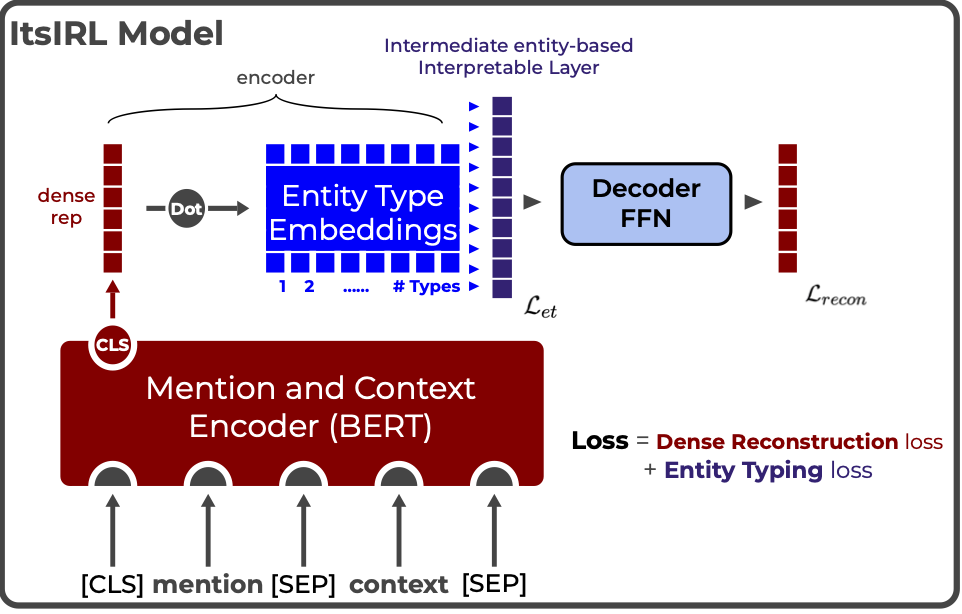

# ItsIRL
## Intermediate Entity-based Sparse Interpretable Representation Learning

> [**Intermediate Entity-based Sparse Interpretable Representation Learning**](https://arxiv.org/abs/2106.09502)<br/>
> Diego Garcia-Olano, Yasumasa Onoe, Joydeep Ghosh, Byron Wallace<br/>
> Blackbox NLP workshop at EMNLP 2022

- Paper: [ [Arxiv preprint]() ]
- Poster: [ [pdf](https://github.com/diegoolano/itsirl/blob/main/notebooks/poster_large.pdf) ]



<pre>
1. See ier_model/README.md for how to pretrain ItsIRL model
2. See experiments/README.md for how to run pretrained ItsIRL model on two tasks in paper ( ELC and BIOSSES )
3. See notebooks/ for the 3 notebooks related to:
   - Counterfactual Entity Type manipulation and learning Global Prototypes over ELC data
   - Entity Type Sparsity analysis for BIOSSES data
   - Baseline numbers for BIOSSES tasks ( Baselines for ELC found in BIERs repo )

Notebooks contained saved model checkpoints both for pre-trained ItsIRL and task specific fine-tuned models.
</pre>
ier_model/ code adapted from [ [BIERs github](https://github.com/diegoolano/biomedical_interpretable_entity_representations) ]

``` bibtex
@inproceedings{garcia-olano-2022-itsirl,
    title = "Intermediate Entity-based Sparse Interpretable Representation Learning",
    author = "Garcia-Olano, Diego  and
      Onoe, Yasumasa and
      Ghosh, Joydeep and
      Wallace, Byron",
    booktitle = "Proceedings of the Fifth BlackboxNLP Workshop on Analyzing and Interpreting Neural Networks for NLP",
    month = dec,
    year = "2022",
    address = "Abu Dhabi, United Arab Emirates",
    publisher = "Association for Computational Linguistics",
}
